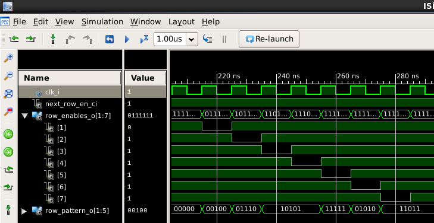

# VHDL LED 5x7 Dot Matrix Example

VHDL 5x7 dot matrix display row selector with hard-coded pattern.  Simulation and synthesis proven on a Spartan-3E FPGA devboard.

Current limiting resistors are recommended for direct wiring to FPGA I/O.  Typically 100-ohms on the row connections will suffice.  The LEDs will generally be dim when driven from the FPGA, and an appropriate current driver is needed for a bright display.

The module is designed to drive a common-cathode or common-anode 5x7 LED dot display similar to this:

The pattern is hard coded to keep the example simple.  In a more complete design, some way to modify the pattern would probably be desirable, but that is left as an exercise for the reader (this is supposed to be a learning example after all).

The outputs from the row selector are registered to keep the display stable and prevent glitching.  The main clock is divided and a clock-enable is generated to provide the desired refresh rate for the display.  Experimenting with the refresh rate can be interesting (for a little while anyway).

Try a 20-bit or 24-bit counter to see the pattern drawn 1-row at a time.  The 16-bit counter creates about a 1ms refresh rate that provides a solid non-flickering display to the human eye.  If you view the display with your phone's camera, you can observe the strobing of the LEDs.

Common Cathode Simulation

Common Anode Simulation

## License
This code is public domain, or licensed under the MIT open source license if you are unhappy about using public domain code.
